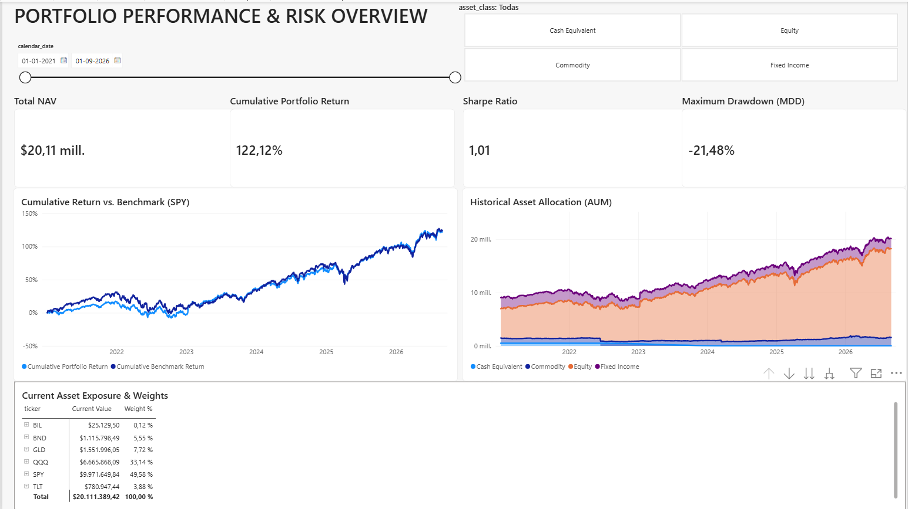
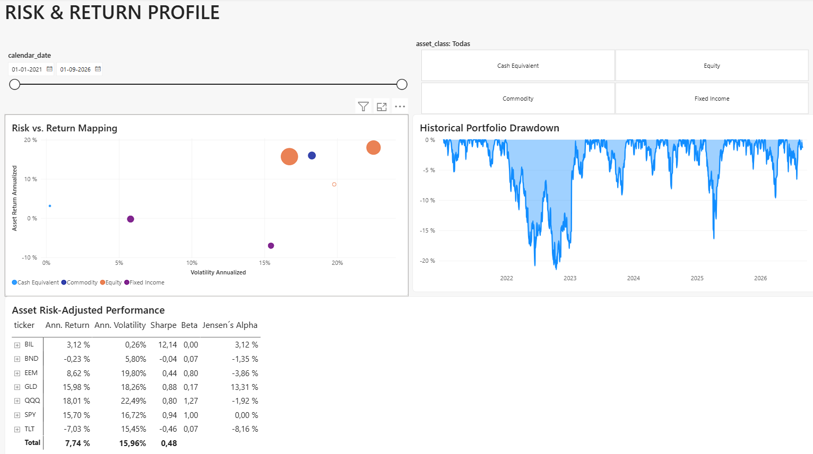

# Multi-Asset Portfolio Performance & Risk Analytics Dashboard

Institutional-grade financial analytics dashboard built in Microsoft Power BI (PBIP format), modeled using daily NAV, historical asset returns, and market risk metrics across multi-asset allocations against the S&P 500 benchmark (`SPY`).

---

## Executive Summary

* **Total Portfolio NAV:** $20.11M
* **Cumulative Portfolio Return:** 122.12%
* **Sharpe Ratio (Annualized, Rf = 0%):** 1.01
* **Maximum Drawdown (MDD):** -21.48%
* **Benchmark:** SPY (SPDR S&P 500 ETF Trust)

---

## Dashboard Architecture

### Tab 1: Portfolio Performance & Risk Overview
* **KPI Trackers:** Consolidated NAV, Cumulative Return, Portfolio Sharpe Ratio, and Historical MDD.
* **Cumulative Return vs. Benchmark:** Relative performance tracking of the multi-asset strategy against `SPY`.
* **Historical Asset Allocation (AUM):** Stacked capital distribution over time partitioned by asset class (`Cash Equivalent`, `Equity`, `Commodity`, `Fixed Income`).
* **Current Asset Exposure & Weights:** Detailed tabular view of current positions, weights, and market values.

---

### Tab 2: Risk & Return Profile (Asset Deep Dive)
* **Risk vs. Return Mapping:** Scatter plot evaluating annualized volatility versus annualized returns sized by total asset exposure.
* **Historical Portfolio Drawdown (Underwater Chart):** Historical continuous drawdown time series tracking capital recovery cycles.
* **Asset Risk-Adjusted Performance Matrix:**
  * **Annualized Return & Volatility** (Scaled with sqrt(252) and 252 trading days).
  * **Asset Sharpe Ratio**.
  * **Asset Beta:** Systemic risk sensitivity relative to `SPY`.
  * **Jensen's Alpha:** Excess risk-adjusted return calibrated via CAPM against SPY.

---

## Project Structure (PBIP)

This project leverages Microsoft Power BI's PBIP format for developer-friendly source control:
* `*.Report`: Visual configurations, layout, formatting, and page definitions.
* `*.SemanticModel`: Tabular model definition, relationships, and DAX measures.
